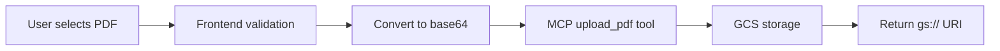
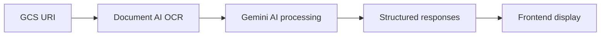
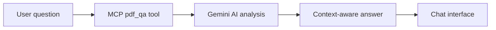

# 🚀 GenAI-exchange (DocuNote)

**GenAI-exchange** is a cutting-edge full-stack application that revolutionizes legal document analysis using **Model Context Protocol (MCP)** architecture. This intelligent system simplifies the understanding of legal documents for both lawyers and non-lawyers through AI-powered analysis.

## 🎯 Key Capabilities

- **📄 PDF Document Processing**: Upload and analyze legal PDFs with intelligent OCR extraction
- **🤖 AI-Powered Q&A**: Get instant answers about document content using Gemini AI via MCP
- **📝 Smart Note-Taking**: Interactive annotation system with page-specific notes
- **🔍 OCR Text Extraction**: Advanced text extraction using Google Cloud Document AI
- **⚖️ Legal Precedent Analysis**: Find relevant case law and legal precedents by jurisdiction
- **🌐 MCP Architecture**: Modern, extensible server using Model Context Protocol for tool integration
- **🔒 Secure Cloud Storage**: Google Cloud Storage integration for document management

## 🏗️ Complete Project Structure

```
GenAI-exchange/
├── backend/                          # MCP Server & AI Backend
│   ├── mcp_app.py                   # Main MCP server with FastAPI
│   ├── app.py                       # Legacy Flask server (commented out)
│   ├── config.yaml                  # Configuration file (empty)
│   ├── requirements-versioned.txt   # Python dependencies with versions
│   ├── test_precedent.py           # Testing script for precedent functionality
│   ├── Class/                      # Core AI modules
│   │   ├── chat.py                 # Gemini AI chat integration
│   │   ├── OCR.py                  # Google Document AI OCR processing  
│   │   └── Precedent.py            # Legal precedent analysis
│   ├── cmd_commands/               # Command utilities
│   │   └── MCP_docker.ipynb       # Docker setup notebook
│   ├── testings/                   # Prototyping & testing notebooks
│   │   ├── bragdocOCR.ipynb
│   │   ├── chatTest.ipynb
│   │   ├── documentai-async-v1.0.0.ipynb
│   │   ├── documentai-sync-v1.0.0.ipynb
│   │   ├── precedent.ipynb
│   │   └── s1.json
│   ├── pdf/                        # Sample PDFs for testing
│   └── uploads/                    # Local PDF upload directory
├── frontend/                        # Next.js Application
│   ├── src/
│   │   ├── app/                    # Next.js app router
│   │   │   ├── page.tsx            # Main application page
│   │   │   ├── layout.tsx          # Root layout
│   │   │   ├── action.ts           # Server actions
│   │   │   └── globals.css         # Global styles
│   │   ├── components/             # React components
│   │   │   ├── docunote-layout.tsx # Main app layout
│   │   │   ├── pdf-viewer.tsx      # PDF viewing component
│   │   │   ├── qna-chat.tsx        # Q&A chat interface
│   │   │   ├── notes-tab.tsx       # Notes management
│   │   │   ├── ocr-view.tsx        # OCR text display
│   │   │   ├── type.ts             # TypeScript interfaces
│   │   │   └── ui/                 # Reusable UI components
│   │   ├── lib/
│   │   │   ├── mcp-client.ts       # MCP client implementation
│   │   │   └── utils.ts            # Utility functions
│   │   └── hooks/                  # React hooks
│   ├── package.json                # Node.js dependencies & scripts
│   ├── tsconfig.json               # TypeScript configuration
│   ├── next.config.ts              # Next.js configuration
│   ├── tailwind.config.js          # Tailwind CSS configuration
│   └── public/                     # Static assets
├── LICENSE                          # Project license
└── README.md                       # This documentation
```

## �️ MCP (Model Context Protocol) Architecture

This application is built using the **Model Context Protocol (MCP)**, providing a standardized way to integrate AI tools and capabilities.

### 🔧 MCP Server (Backend)

The MCP server (`mcp_app.py`) runs on **FastAPI** and provides the following tools:

#### 📋 Available MCP Tools

| Tool Name | Description | Parameters | Returns |
|-----------|-------------|------------|---------|
| `upload_pdf` | Upload PDF to Google Cloud Storage | `filename` (str), `file_data` (base64) | GCS URI or local path |
| `pdf_qa` | Ask questions about PDF content | `question` (str), `gsUri` (str, optional) | AI-generated answer |
| `extract_text_from_pdf` | OCR text extraction from PDF | `gcs_uri` (str) | Structured text data with pages |
| `find_legal_precedents` | Find relevant case law | `clause` (str), `location` (str, default="US") | Legal precedents analysis |

#### 🌐 MCP Server Endpoints

- **Main Server**: `http://localhost:8080`
- **MCP Endpoint**: `http://localhost:8080/mcp/`
- **Health Check**: `http://localhost:8080/health`
- **Root**: `http://localhost:8080/` (status information)

#### 🔌 MCP Integration Features

- **FastMCP Framework**: Modern MCP server implementation
- **Streamable HTTP Transport**: Real-time communication with frontend
- **CORS Configuration**: Cross-origin support for frontend integration
- **Session Management**: MCP session handling with headers
- **Error Handling**: Comprehensive error handling and logging

### 🤖 AI Components Integration

#### Google Cloud Document AI
- **Project ID**: `sodium-coil-470706-f4`
- **Location**: `us` (US region)
- **Processor ID**: `18d898182b219656`
- **Capabilities**: PDF text extraction, form field detection, confidence scoring

#### Google Vertex AI (Gemini)
- **Model**: `gemini-2.5-flash-lite`
- **Location**: `us-central1`
- **Features**: Legal document Q&A, precedent analysis, plain-language summaries

#### Google Cloud Storage
- **Bucket**: `legal-doc-bucket1`
- **Purpose**: Secure PDF storage and URI generation for AI processing

## 💻 Frontend (Next.js 15)

### 🎨 Modern React Application

Built with **Next.js 15** using the app router and modern React patterns:

#### 🧩 Core Components

- **`docunote-layout.tsx`**: Main application layout with sidebar and tab navigation
- **`pdf-viewer.tsx`**: Interactive PDF viewer with annotation capabilities
- **`qna-chat.tsx`**: AI-powered chat interface for document questions
- **`notes-tab.tsx`**: Note management with page-specific annotations
- **`ocr-view.tsx`**: OCR text display and search functionality

#### 🔗 MCP Client Integration

The frontend uses a sophisticated MCP client (`mcp-client.ts`) that provides:

```typescript
// Key MCP Client Features
- Real-time connection management
- Streamable HTTP transport
- Automatic reconnection handling
- Tool calling abstraction
- TypeScript type safety
```

#### 📱 UI/UX Features

- **Responsive Design**: Mobile-first approach with Tailwind CSS
- **Glass Morphism**: Modern UI with backdrop blur effects
- **Real-time Status**: MCP connection status indicators
- **Drag & Drop**: Intuitive PDF upload experience
- **Progressive Enhancement**: Works offline for basic PDF viewing

### 🔧 Frontend Dependencies

```json
{
  "key_dependencies": {
    "@modelcontextprotocol/sdk": "^1.18.1",  // MCP client
    "next": "15.5.2",                        // Next.js framework
    "react": "19.1.0",                       // React 19
    "react-pdf": "^10.1.0",                 // PDF rendering
    "pdfjs-dist": "^5.3.93",               // PDF.js core
    "@radix-ui/*": "^1.x.x",               // UI components
    "tailwindcss": "^4",                    // Styling
    "framer-motion": "^12.23.12"           // Animations
  }
}
```

## 🔄 Complete Application Workflow

### 1. 📤 PDF Upload Process


### 2. 🤖 AI Analysis Pipeline


### 3. 💬 Q&A Interaction


## Prerequisites

### 🔧 System Requirements

- **Node.js**: v18+ (for frontend)
- **Python**: v3.10+ (for backend)
- **PowerShell**: v5.1+ (Windows)
- **Git**: For version control

### ☁️ Google Cloud Setup

1. **Google Cloud Project**: Active project with billing enabled
2. **APIs Enabled**:
   - Document AI API
   - Vertex AI API  
   - Cloud Storage API
3. **Service Account**: JSON key file with appropriate permissions
4. **GCS Bucket**: For PDF storage (`legal-doc-bucket1`)

### 🔐 Required Permissions

Your Service Account needs these IAM roles:
- `Storage Object Admin` (for GCS)
- `AI Platform User` (for Vertex AI)
- `Document AI API User` (for Document AI)

## ⚙️ Complete Setup Instructions

### 🖥️ Backend Setup (MCP Server)

1. **Navigate to backend directory**:
   ```powershell
   cd backend
   ```

2. **Create Python virtual environment**:
   ```powershell
   python -m venv .venv
   .venv\Scripts\Activate.ps1
   ```

3. **Install dependencies**:
   ```powershell
   pip install --upgrade pip
   pip install -r requirements-versioned.txt
   ```

4. **Alternative: Install specific packages**:
   ```powershell
   pip install fastapi uvicorn fastmcp google-cloud-storage google-cloud-documentai google-genai
   ```

5. **Configure environment variables**:
   ```powershell
   # Set Google Cloud credentials
   $env:GOOGLE_APPLICATION_CREDENTIALS = "C:\path\to\service-account-key.json"
   
   # Set project configuration
   $env:PROJECT_ID = "sodium-coil-470706-f4"
   $env:BUCKET_NAME = "legal-doc-bucket1"
   $env:MCP_NAME = "LegalDemystifierMCP"
   $env:PORT = "8080"
   ```

6. **Run the MCP server**:
   ```powershell
   python mcp_app.py
   ```

   The server will start at: `http://localhost:8080`

### 🌐 Frontend Setup (Next.js)

1. **Navigate to frontend directory**:
   ```powershell
   cd frontend
   ```

2. **Install dependencies**:
   ```powershell
   npm install
   # or yarn install
   # or pnpm install
   ```

3. **Configure environment**:
   Create `.env.local` file:
   ```env
   NEXT_PUBLIC_MCP_SERVER_URL=http://localhost:8080/mcp/
   ```

4. **Run development server**:
   ```powershell
   npm run dev
   # or yarn dev
   # or pnpm dev
   ```

   Frontend will be available at: `http://localhost:3000`

### 🧪 Testing the Setup

1. **Test MCP server health**:
   ```powershell
   curl http://localhost:8080/health
   ```

2. **Test MCP endpoint**:
   ```powershell
   curl http://localhost:8080/mcp/
   ```

3. **Upload test PDF via frontend**:
   - Open `http://localhost:3000`
   - Upload a PDF document
   - Verify MCP connection status shows "Connected"

## 🛠️ MCP Tools Documentation

### 📄 upload_pdf

**Purpose**: Upload PDF files to Google Cloud Storage

**Parameters**:
- `filename` (string, required): Name of the PDF file
- `file_data` (string, required): Base64-encoded PDF data
- `bucket_name` (string, optional): GCS bucket name

**Returns**:
```json
{
  "message": "File uploaded to GCS",
  "gcs_uri": "gs://bucket-name/filename.pdf"
}
```

**Example Usage**:
```typescript
const result = await mcpClient.callTool('upload_pdf', {
  filename: 'contract.pdf',
  file_data: base64Data
});
```

### 💬 pdf_qa

**Purpose**: Ask questions about PDF content using AI

**Parameters**:
- `question` (string, required): The question to ask
- `gsUri` (string, optional): GCS URI of the PDF

**Returns**:
```json
{
  "answer": "AI-generated response based on PDF content"
}
```

**Example Usage**:
```typescript
const result = await mcpClient.callTool('pdf_qa', {
  question: "What are the key terms of this contract?",
  gsUri: "gs://bucket/contract.pdf"
});
```

### 🔍 extract_text_from_pdf

**Purpose**: Extract text from PDF using Google Document AI

**Parameters**:
- `gcs_uri` (string, required): GCS URI of the PDF

**Returns**:
```json
{
  "success": true,
  "full_text": "Complete extracted text...",
  "pages": [
    {
      "page_number": 1,
      "text": "Page 1 content...",
      "confidence": 0.98
    }
  ],
  "form_fields": [...],
  "confidence_score": 0.95,
  "total_pages": 5,
  "total_characters": 12500
}
```

### ⚖️ find_legal_precedents

**Purpose**: Find relevant legal precedents for clauses

**Parameters**:
- `clause` (string, required): Legal clause text to analyze
- `location` (string, optional): Jurisdiction (default: "US")

**Returns**:
```json
{
  "success": true,
  "clause": "Original clause text",
  "location": "California",
  "precedents": "Formatted precedent analysis..."
}
```

**Supported Jurisdictions**:
- `US` (Federal)
- `California`, `New York`, `Texas` (US States)
- `India`, `UK`, `EU` (International)

## 🚀 Advanced Features

### 🔄 Real-time MCP Connection

The frontend automatically manages MCP connections:

```typescript
// Connection status monitoring
const [connectionStatus, setConnectionStatus] = useState<'checking' | 'connected' | 'error'>('checking');

// Automatic reconnection
useEffect(() => {
  const interval = setInterval(async () => {
    const isHealthy = await MCPService.checkHealth();
    setConnectionStatus(isHealthy ? 'connected' : 'error');
  }, 30000);
  
  return () => clearInterval(interval);
}, []);
```

### 📝 Persistent Notes System

Notes are automatically saved to localStorage:

```typescript
// Auto-save notes
useEffect(() => {
  if (pdfFile && notes.length > 0) {
    localStorage.setItem(`docunote-notes-${pdfFile.name}`, JSON.stringify(notes));
  }
}, [notes, pdfFile]);
```

### 🎯 Smart PDF Viewer

Interactive PDF viewer with features:
- **Page Navigation**: Arrow keys, jump to page
- **Text Selection**: Right-click for AI analysis
- **Annotation Support**: Click to add notes
- **Responsive Rendering**: Optimized for all screen sizes

### 🔐 Security Features

- **File Type Validation**: Only PDF files accepted
- **Size Limits**: Configurable upload limits
- **CORS Protection**: Restricted origins in production
- **Input Sanitization**: XSS protection for user inputs

## 📊 Application Performance

### 🚄 Optimization Features

- **Turbopack**: Next.js development with Turbopack for faster builds
- **Streaming**: Real-time MCP communication
- **Lazy Loading**: Components loaded on demand
- **Caching**: Intelligent PDF and response caching
- **Compression**: Optimized asset delivery

### 📈 Scalability

- **Horizontal Scaling**: Multiple MCP server instances
- **Load Balancing**: Distribute PDF processing load
- **Cloud Storage**: Unlimited PDF storage capacity
- **CDN Ready**: Static asset optimization

## 🔧 Development Commands

### Backend Commands

```powershell
# Start MCP server
python mcp_app.py

# Test precedent functionality
python test_precedent.py

# Install requirements
pip install -r requirements-versioned.txt

# Health check
curl http://localhost:8080/health
```

### Frontend Commands

```powershell
# Development server
npm run dev

# Production build
npm run build

# Start production server
npm start

# Lint code
npm run lint

# Install dependencies
npm install
```

## 🐳 Docker Deployment

### Backend Docker Setup

Create `Dockerfile` in backend directory:

```dockerfile
FROM python:3.11-slim

WORKDIR /app
COPY requirements-versioned.txt .
RUN pip install -r requirements-versioned.txt

COPY . .
EXPOSE 8080

CMD ["python", "mcp_app.py"]
```

### Frontend Docker Setup

Create `Dockerfile` in frontend directory:

```dockerfile
FROM node:18-alpine

WORKDIR /app
COPY package*.json ./
RUN npm install

COPY . .
RUN npm run build

EXPOSE 3000
CMD ["npm", "start"]
```

### Docker Compose

Create `docker-compose.yml`:

```yaml
version: '3.8'
services:
  backend:
    build: ./backend
    ports:
      - "8080:8080"
    environment:
      - GOOGLE_APPLICATION_CREDENTIALS=/app/credentials.json
      - PROJECT_ID=sodium-coil-470706-f4
      - BUCKET_NAME=legal-doc-bucket1
    volumes:
      - ./backend/credentials.json:/app/credentials.json
  
  frontend:
    build: ./frontend
    ports:
      - "3000:3000"
    environment:
      - NEXT_PUBLIC_MCP_SERVER_URL=http://backend:8080/mcp/
    depends_on:
      - backend
```

## 🔧 Environment Configuration

### Backend Environment Variables

```bash
# Google Cloud Configuration
GOOGLE_APPLICATION_CREDENTIALS=/path/to/service-account.json
PROJECT_ID=sodium-coil-470706-f4
BUCKET_NAME=legal-doc-bucket1

# MCP Server Configuration
MCP_NAME=LegalDemystifierMCP
PORT=8080
FRONTEND_ORIGIN=http://localhost:3000

# AI Configuration
VERTEX_AI_LOCATION=us-central1
DOCUMENT_AI_LOCATION=us
DOCUMENT_AI_PROCESSOR_ID=18d898182b219656
```

### Frontend Environment Variables

```bash
# MCP Client Configuration
NEXT_PUBLIC_MCP_SERVER_URL=http://localhost:8080/mcp/

# Application Configuration
NEXT_PUBLIC_APP_NAME=DocuNote
NEXT_PUBLIC_VERSION=1.0.0
```

## 🧪 Testing & Quality Assurance

### Backend Testing

```powershell
# Test MCP tools
python test_precedent.py

# Test Google Cloud connections
python -c "from Class.OCR import process_pdf_with_document_ai; print('OCR module ready')"
python -c "from Class.chat import automated_chat; print('Chat module ready')"
python -c "from Class.Precedent import find_precedents; print('Precedent module ready')"

# Test MCP server
curl -X POST http://localhost:8080/mcp/ \
  -H "Content-Type: application/json" \
  -d '{"method": "tools/list"}'
```

### Frontend Testing

```powershell
# Component testing
npm test

# E2E testing with Playwright
npm run test:e2e

# Type checking
npm run type-check

# Linting
npm run lint

# Build verification
npm run build
```

### Integration Testing

1. **Upload Flow**: Test PDF upload through MCP
2. **OCR Processing**: Verify Document AI integration
3. **Q&A System**: Test Gemini AI responses
4. **Precedent Analysis**: Validate legal research
5. **Real-time Features**: Test MCP connection handling

## 📱 Deployment Strategies

### 🌟 Production Deployment

#### Google Cloud Run (Recommended)

**Backend Deployment**:
```powershell
# Build and deploy MCP server
gcloud run deploy genai-exchange-backend \
  --source ./backend \
  --platform managed \
  --region us-central1 \
  --allow-unauthenticated
```

**Frontend Deployment on Vercel**:
```powershell
# Deploy Next.js app
vercel --prod
```

#### Alternative Platforms

- **Backend**: Google Cloud Run, AWS Lambda, Railway, Render
- **Frontend**: Vercel, Netlify, AWS Amplify, Firebase Hosting

### 🔒 Production Security

```bash
# Remove development CORS
ALLOWED_ORIGINS=https://your-frontend-domain.com

# Use environment secrets
GOOGLE_APPLICATION_CREDENTIALS=/secrets/service-account.json

# Enable HTTPS only
SECURE_COOKIES=true
HTTPS_ONLY=true
```

## 🎯 API Reference

### MCP Server Endpoints

| Endpoint | Method | Purpose | Authentication |
|----------|--------|---------|----------------|
| `/` | GET | Server status | None |
| `/health` | GET | Health check | None |
| `/mcp/` | POST | MCP protocol endpoint | MCP headers |

### MCP Protocol Headers

```http
Content-Type: application/json
MCP-Session-Id: unique-session-id
MCP-Protocol-Version: 1.0
```

### Error Handling

```json
{
  "error": "Error description",
  "code": "ERROR_CODE",
  "details": {
    "tool": "tool_name",
    "parameter": "invalid_value"
  }
}
```

## 🔍 Monitoring & Debugging

### Application Logs

**Backend Logs**:
```python
# MCP server logs
logging.basicConfig(level=logging.INFO)
logger = logging.getLogger("mcp_app")
```

**Frontend Logs**:
```typescript
// MCP client debugging
console.log('🔗 MCP Client connected:', connected);
console.log('📞 Calling tool:', toolName, parameters);
```

### Health Monitoring

```powershell
# Backend health
curl http://localhost:8080/health

# MCP endpoint health
curl -X POST http://localhost:8080/mcp/ \
  -H "Content-Type: application/json" \
  -d '{"method": "ping"}'
```

### Performance Metrics

- **PDF Upload Time**: Target < 5 seconds
- **OCR Processing**: Target < 30 seconds  
- **Q&A Response**: Target < 10 seconds
- **MCP Connection**: Target < 1 second

## 🤝 Contributing

### Development Workflow

1. **Fork the repository**
2. **Create feature branch**: `git checkout -b feature/amazing-feature`
3. **Setup development environment**:
   ```powershell
   # Backend setup
   cd backend
   python -m venv .venv
   .venv\Scripts\Activate.ps1
   pip install -r requirements-versioned.txt
   
   # Frontend setup
   cd ../frontend
   npm install
   ```
4. **Make changes and test**
5. **Commit changes**: `git commit -m 'Add amazing feature'`
6. **Push to branch**: `git push origin feature/amazing-feature`
7. **Open Pull Request**

### Code Quality Standards

- **Python**: Follow PEP 8, use type hints
- **TypeScript**: Strict mode enabled, proper interfaces
- **Testing**: Unit tests for all MCP tools
- **Documentation**: Update README for new features

### Development Tools

```powershell
# Backend tools
pip install black isort mypy pytest

# Frontend tools
npm install -D @types/node typescript eslint prettier
```

## 🐛 Troubleshooting

### Common Issues

#### MCP Connection Failed
```powershell
# Check server status
curl http://localhost:8080/health

# Verify MCP endpoint
curl http://localhost:8080/mcp/

# Check CORS settings
# Ensure frontend origin is in allowed_origins
```

#### Google Cloud Authentication
```powershell
# Verify credentials
$env:GOOGLE_APPLICATION_CREDENTIALS
gcloud auth application-default print-access-token

# Test API access
python -c "from google.cloud import storage; print(storage.Client().list_buckets())"
```

#### PDF Upload Issues
```powershell
# Check file permissions
ls -la uploads/

# Verify GCS bucket access
gsutil ls gs://legal-doc-bucket1/

# Test Document AI
python -c "from Class.OCR import process_pdf_with_document_ai; print('OCR ready')"
```

#### Frontend Build Errors
```powershell
# Clear cache
npm run clean
rm -rf .next node_modules
npm install

# Check TypeScript
npm run type-check

# Verify environment variables
echo $NEXT_PUBLIC_MCP_SERVER_URL
```

### Debug Mode

Enable detailed logging:

```powershell
# Backend debug mode
$env:LOG_LEVEL = "DEBUG"
python mcp_app.py

# Frontend debug mode
$env:NODE_ENV = "development"
npm run dev
```

## 🌟 Future Enhancements

### Planned Features

- **📊 Analytics Dashboard**: Document processing metrics
- **🔐 User Authentication**: Multi-user support with OAuth
- **📚 Document Comparison**: Compare multiple legal documents
- **🎨 Custom Templates**: Legal document templates
- **🌍 Multi-language Support**: International legal systems
- **📱 Mobile App**: React Native mobile application
- **🔍 Advanced Search**: Full-text search across documents
- **📈 Usage Analytics**: Track user interactions and performance

### Technical Roadmap

- **WebSocket Support**: Real-time collaborative features
- **Microservices**: Split MCP tools into separate services
- **Kubernetes**: Container orchestration for scalability
- **GraphQL**: Advanced API query capabilities
- **Edge Computing**: CDN-based processing for global scale

## 📄 License

This project is licensed under the MIT License - see the [LICENSE](LICENSE) file for details.

## 🙏 Acknowledgments

- **Google Cloud Platform**: Document AI, Vertex AI, Cloud Storage
- **Model Context Protocol**: Modern AI tool integration framework
- **Next.js Team**: Amazing React framework
- **FastAPI**: High-performance Python API framework
- **Open Source Community**: Various libraries and tools used

---

**🚀 Ready to revolutionize legal document analysis? Get started with GenAI-exchange today!**

For support, issues, or feature requests, please visit our [GitHub repository](https://github.com/selvatharrun/GenAI-exchange).

*Built with ❤️ using MCP, Next.js, and Google Cloud AI*
